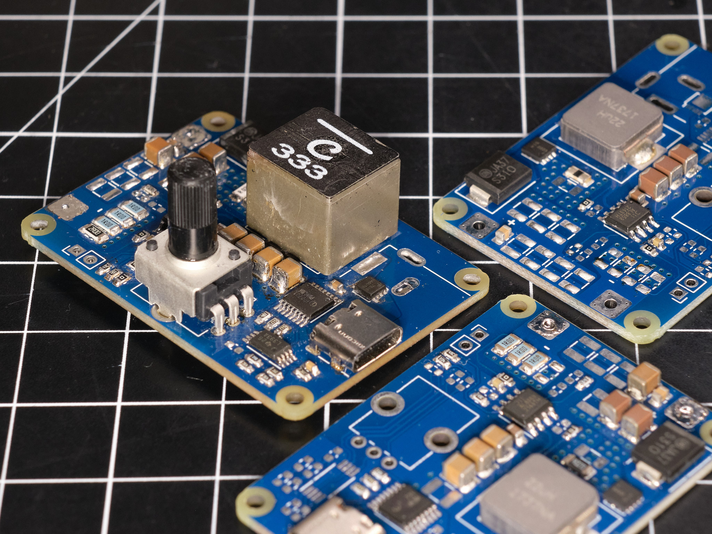

# power-led-drivers

## Features

### boostdriver-AL8853 rev1

* Input voltage range: 6-40V
* Input current up to 3A, higher current possible with cooling
* Output voltage up to 80V, higher voltage possible with modifications
* Up to 93% efficient at 20V input, ~75V 50W output
* Based on the [Diodes Incorporated AL8853 boost controller](https://www.diodes.com/assets/Datasheets/AL8853.pdf)
* Optional onboard USB-C power input (>50W output from USB without a heatsink)
* PWM input for brightness control
* Optional onboard dimmer for self-contained standalone use

## Design

### boostdriver-AL8853 rev1

[Schematic as PDF](pcb/schematic%20rev1%2020230619-01.pdf)

## Component Selection

Component selections should be based on the <a href="https://www.diodes.com/assets/Calculators/AL8853-Calculator.xlsx">AL8853 Design Calculator spreadsheet</a> provided by Diodes Incorporated.

For most applications, the components shown in the schematic can be left as-is except for the inductor and current sense resistor. Molded composite inductors are strongly recommended, and physically larger inductors will generally provide better efficiency and thermal performance. The switching FET listed in the schematic may be out of stock, but many suitable parts are available. The PCB footprint will accommodate a 3.3mm DFN package; [this DigiKey search](https://www.digikey.com/en/products/filter/transistors-fets-mosfets-single/278?s=N4IgjCBcoGwJxVAYygMwIYBsDOBTANCAPZQDaIALAAxwDMdIh1cFtVIAuoQA4AuUIAMq8ATgEsAdgHMQAX0IwqMRCBSQMOAsTIhaAdgAccY5x79IQ0ZJnzwAJjgRoqtFjyESkchTp2ArMqEDvQsjCAO1GB%2BYRFUYIHhLHG0MSxgeilBaQZ6qRRgDFkUFAYQRSV2eXp%2BZYkU1Zl1pblFpQitdrUReo55cDAtdXAZqX5Ufo0Ufn4UDqO0FAkOE-rzPvM5YbS0BtQUWzvUBmFTPXaN27tg7IQLYG1bAROVtzD1doNTcGMXBjB2ii2fwBtRKBnOtR2-3%2BJ0uoVuwJgv2G5xO4No-iBLD8xwRLD0N10RneWMW7SJLG%2BWL8H2pbGpczxzzpk3SH2iTAKxVZLHqJy5JROnX6uS4ID4AmE4mkciCSmOzjUGnc2i84CoVAABAA1Uzi8wgACqEjEvAA8qgALK4dDYACuIlwspAAFoEIqoKI7VpPOQIBxbC7Kh7IF6fTpogHZLIgA) shows compatible parts.

More detailed information on component selection is provided in the annotations in the schematic.

### License
This project is released under the CERN Open Hardware Licence Version 2 - Weakly Reciprocal (CERN-OHL-W V2).
